# Knowledge Base (RAG-Enhanced Pentesting Knowledge)

The Knowledge Base (KB) adds offline, retrieval-augmented search to the yousef_shtiwe agent. Instead of relying solely on Tavily web search, the agent queries a local vector index (FAISS) and graph database (Neo4j) populated with curated security datasets. When the local KB produces high-confidence results, Tavily is skipped entirely. When confidence is low, KB and Tavily results are merged.

---

## Table of Contents

- [Architecture Overview](#architecture-overview)
- [Data Sources](#data-sources)
- [Ingestion Pipeline](#ingestion-pipeline)
- [Query Pipeline](#query-pipeline)
- [Agent Integration](#agent-integration)
- [Docker Services](#docker-services)
- [Configuration](#configuration)
- [CLI Commands](#cli-commands)
- [Scheduled Refresh](#scheduled-refresh)
- [Security Model](#security-model)
- [Per-Project Runtime Tuning](#per-project-runtime-tuning)
- [Embedding: CPU vs GPU vs API](#embedding-cpu-vs-gpu-vs-api)
- [Ingestion Entry Points](#ingestion-entry-points)
- [Query Entry Points](#query-entry-points)
- [Troubleshooting](#troubleshooting)

---

## Architecture Overview

The KB system has two main phases: **ingestion** (offline, batch) and **query** (runtime, per-request). Ingestion fetches security datasets, chunks them, embeds them with a sentence-transformer model, and stores vectors in FAISS and metadata in Neo4j. At query time, the agent runs a hybrid retrieval pipeline combining vector similarity and keyword search, fuses results with Reciprocal Rank Fusion (RRF), reranks with a cross-encoder, and applies diversity filtering before returning results.

```mermaid
graph TB
    subgraph "Ingestion Phase"
        DS[Data Sources<br/>NVD, GTFOBins, LOLBAS,<br/>Nuclei, OWASP, ExploitDB,<br/>Tool Docs]
        SH[safe_get<br/>hostname-allowlisted HTTP]
        FC[File Cache<br/>.file_hashes.json]
        CH[Chunking<br/>structured or markdown]
        FU[Content-Hash Filter<br/>.manifest.json]
        EM1[Embedder<br/>e5-large-v2]
        FI1[FAISS Index<br/>index.faiss]
        NL1[Neo4j Loader<br/>KBChunk nodes]

        DS --> SH
        SH --> FC
        FC --> CH
        CH --> FU
        FU --> EM1
        EM1 --> FI1
        EM1 --> NL1
    end

    subgraph "Query Phase"
        AQ[Agent Query<br/>web_search tool]
        EM2[Embedder<br/>embed query]
        VS[FAISS Vector Search]
        FS[Neo4j Fulltext Search<br/>Lucene]
        RRF[RRF Fusion<br/>k=60]
        MF[Metadata Fetch<br/>+ Source Filtering]
        SB[Source Boosts]
        RR[Cross-Encoder Rerank<br/>bge-reranker-base]
        MMR[MMR Diversity Filter]
        SC[Sufficiency Check<br/>score >= 0.35?]
        TV[Tavily Fallback]
        RES[Results to Agent]

        AQ --> EM2
        EM2 --> VS
        AQ --> FS
        VS --> RRF
        FS --> RRF
        RRF --> MF
        MF --> SB
        SB --> RR
        RR --> MMR
        MMR --> SC
        SC -->|sufficient| RES
        SC -->|insufficient| TV
        TV --> RES
    end
```

---

## Data Sources

The KB ingests from seven curated security data sources, organized into three profiles.

### Profiles

| Profile | Sources | Build Time (CPU) | Build Time (GPU/API) |
|---|---|---|---|
| **cpu-lite** | tool_docs, gtfobins, lolbas | ~15 min | ~2 min |
| **lite** | cpu-lite + owasp, exploitdb | ~4 hours | ~3 min |
| **standard** | lite + nvd | ~4-5 hours | ~8 min |
| **full** | standard + nuclei | ~5-6 hours | ~15 min |

### Source Details

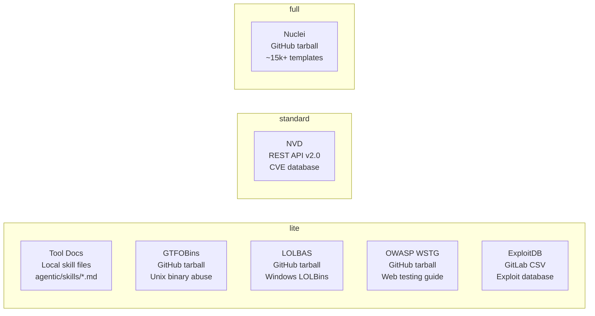

| Source | Origin | Transport | Chunk Strategy | Chunk Count |
|---|---|---|---|---|
| **tool_docs** | `agentic/skills/*.md` | Local filesystem | Summary chunk per tooling file; section-chunked for others | ~50-100 |
| **gtfobins** | `github.com/GTFOBins` | HTTPS tarball | One chunk per binary per function type | ~400-500 |
| **lolbas** | `github.com/LOLBAS-Project` | HTTPS tarball | One chunk per binary per command | ~800-1000 |
| **owasp** | `github.com/OWASP/wstg` | HTTPS tarball | Markdown section-chunked by `##` headers | ~500-700 |
| **exploitdb** | `gitlab.com/exploit-database` | HTTPS CSV | One chunk per exploit entry | ~45,000+ |
| **nvd** | `services.nvd.nist.gov` | REST API v2.0 | One chunk per CVE | ~7,500 (90d, CVSS>=7) |
| **nuclei** | `github.com/projectdiscovery` | HTTPS tarball | One chunk per template | ~15,000+ |

### Source Boosts

Each source has a relevance boost factor applied during scoring. Higher boosts favor results from sources that tend to be more directly actionable:

| Source | Boost | Rationale |
|---|---|---|
| tool_docs | 1.20 | Directly actionable, agent-specific playbooks |
| gtfobins | 1.15 | Precise, high-signal for Unix priv-esc |
| lolbas | 1.15 | Precise, high-signal for Windows LOLBins |
| owasp | 1.05 | Methodology-focused, solid reference |
| nuclei | 1.00 | Baseline (high volume, variable relevance) |
| nvd | 0.90 | Context-rich but often not directly actionable |
| exploitdb | 0.85 | High volume, variable quality |

---

## Ingestion Pipeline

The ingestion pipeline downloads, parses, chunks, embeds, and indexes security data. It supports incremental updates (only re-embeds changed content) and full rebuilds.

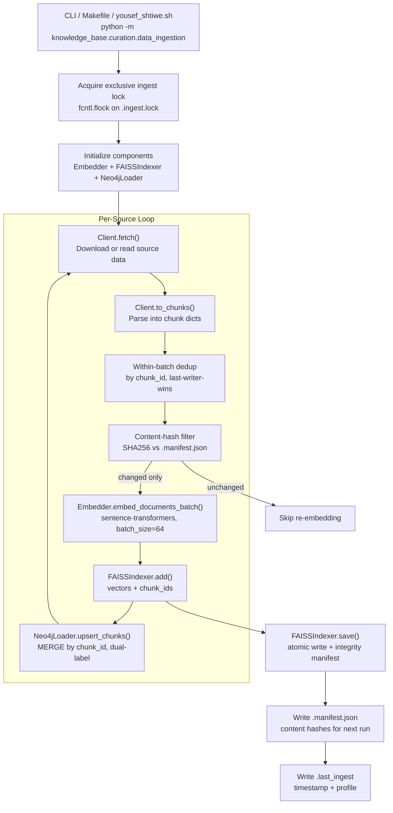

### Incremental Update Logic

The pipeline uses a two-layer caching system to avoid redundant work:

**Layer 1 -- File-level cache** (tarball sources only): Each downloaded file is hashed. On the next run, only files with changed hashes are re-parsed. Stored in `data/cache/<source>/.file_hashes.json`.

**Layer 2 -- Chunk content-hash filter**: After chunking, each chunk's content is SHA-256 hashed. If a chunk's hash matches the previous run's manifest (`data/cache/.manifest.json`), it is skipped entirely -- no re-embedding, no re-upserting. This catches cases where files changed but the extracted chunks did not.

### NVD-specific behavior

- Paginated API with 2000 results per page and 120-day windows (API limit)
- Rate limiting: 6.5s between requests without API key, 0.65s with key
- Incremental mode: when `.last_ingest` exists, uses `lastModStartDate` to only fetch recently modified CVEs
- Unified cache: all CVEs merged into `nvd_cache.json` keyed by CVE ID

---

## Query Pipeline

When the agent calls `web_search()`, the KB runs a 6-stage hybrid retrieval pipeline.

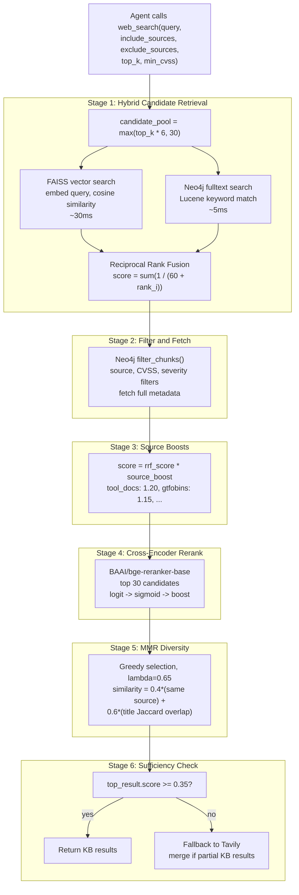

### Scoring Details

- **RRF** uses k=60 (standard). Rank-based, scale-invariant.
- **Source boosts** are multiplicative on the RRF score (pre-rerank) and on the sigmoid-transformed reranker score (post-rerank).
- **Cross-encoder** returns raw logits (can be negative). Sigmoid is applied before boosting to ensure correct directionality.
- **MMR** uses a lightweight similarity proxy (no stored vectors): `0.4 * same_source + 0.6 * title_jaccard`. Lambda=0.65 slightly favors relevance over diversity.
- **Sufficiency threshold** defaults to 0.35. Below this, Tavily is queried as a fallback.

---

## Agent Integration

The KB integrates into the agent's tool system through the `web_search` tool. The agent does not interact with the KB directly -- it calls `web_search()` with optional filtering parameters, and the tool transparently queries KB first, falling back to Tavily when needed.

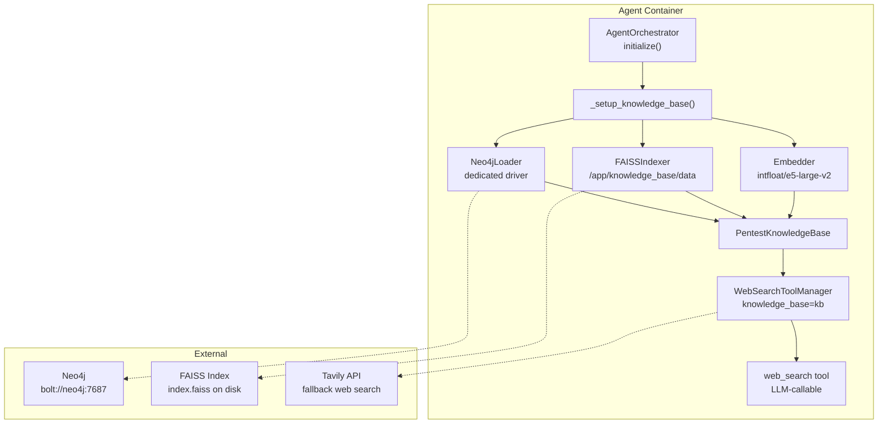

### Initialization Sequence

1. `AgentOrchestrator.initialize()` calls `_setup_knowledge_base()`
2. Feature gate: checks `KB_ENABLED` env var (default `true`). If `false`, returns `None`
3. Dynamic import of KB modules (graceful degradation if dependencies missing)
4. Creates `Embedder` (model from `KB_EMBEDDING_MODEL` env var or config)
5. Creates `FAISSIndexer` pointed at `KB_PATH` (default `/app/knowledge_base/data`)
6. Creates a **dedicated** Neo4j driver (separate from the graph query driver)
7. Assembles `PentestKnowledgeBase` and calls `kb.load()` to read the FAISS index from disk
8. Injects KB into `WebSearchToolManager`
9. On any failure, logs a warning and starts without KB (Tavily-only mode)

### Fallback Cascade

The `web_search` tool implements a three-tier fallback:

| Condition | Behavior |
|---|---|
| KB score >= threshold (0.35) | Return KB results only, skip Tavily |
| KB score < threshold | Query Tavily, merge KB partial results with Tavily results |
| KB fails, Tavily succeeds | Return Tavily results only |
| Tavily fails, KB has partial results | Return KB results with "(Tavily unavailable)" header |
| Both fail | Return "No results found" |

### Prompt Injection Defense

KB content is untrusted (sourced from public repositories). Three layers prevent prompt injection:

1. **Content sanitization**: Strips XML role tags (`<system>`, `<user>`), instruction markers (`[INST]`), ChatML tokens (`<|im_start|>`), and self-referential frame markers
2. **Length capping**: 2000 chars per chunk, 10 items per list
3. **Untrusted framing**: All KB output is wrapped in explicit delimiters with a warning instructing the LLM to treat content as reference only

### Tool Description (what the LLM sees)

The `web_search` tool exposed to the agent supports these KB-specific parameters:

| Parameter | Type | Description |
|---|---|---|
| `query` | string | Search query |
| `include_sources` | list | Only return results from these sources |
| `exclude_sources` | list | Exclude results from these sources |
| `top_k` | int (1-20) | Number of results to return |
| `min_cvss` | float | Minimum CVSS score (NVD/Nuclei only) |

---

## Docker Services

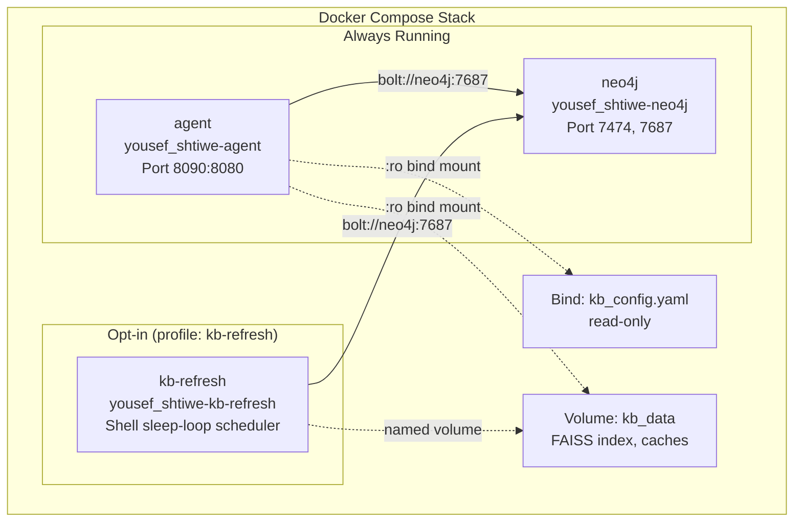

### Agent Container

- **Image**: `yousef_shtiwe-agent` (built from `agentic/Dockerfile`)
- **Build context**: project root (so `knowledge_base/` is included)
- **Pre-cached models**: `intfloat/e5-large-v2` (~1.3 GB) and `BAAI/bge-reranker-base` (~568 MB) downloaded at build time
- **KB volumes**:
  - `./knowledge_base/kb_config.yaml:/app/knowledge_base/kb_config.yaml:ro` -- config
  - `./knowledge_base/data:/app/knowledge_base/data:ro` -- FAISS index and caches
- **KB env vars**: `KB_ENABLED`, `KB_PATH`, `KB_EMBEDDING_MODEL`, `NEO4J_URI/USER/PASSWORD`
- **File permissions**: KB source code is `chmod -R a-w` (read-only), only `data/` is writable

### Neo4j

Shared between the recon graph, agent graph queries, and the KB. KB creates `KBChunk` nodes with a uniqueness constraint on `chunk_id` and a fulltext index on `content` and `title` for Lucene keyword search.

### kb-refresh (Opt-in Sidecar)

- **Profile**: `kb-refresh` (must be explicitly enabled)
- **Image**: Same `yousef_shtiwe-agent` image, different entrypoint
- **Schedule**:
  - Daily: NVD incremental update
  - Mondays: ExploitDB + Nuclei
  - 1st of month: GTFOBins + LOLBAS
- **Enable**: `KB_REFRESH_ENABLED=true docker compose --profile kb-refresh up -d kb-refresh`

---

## Configuration

All KB behavior is controlled through a layered configuration system. Each layer overrides the one below it.

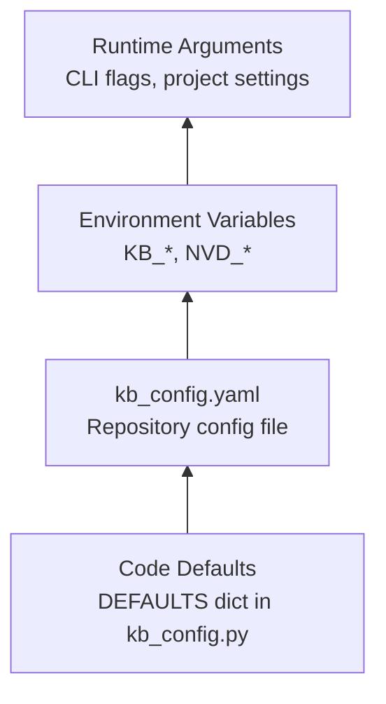

### Configuration File: `kb_config.yaml`

Located at `knowledge_base/kb_config.yaml`. Mounted read-only into the agent container.

```yaml
KB_ENABLED: true

embedder:
  model: "intfloat/e5-large-v2"   # 1024 dimensions, 512 token cap
  batch_size: 64

chunking:
  max_tokens: 480                  # hard cap per chunk
  preferred_tokens: 256            # soft target for markdown splitting

reranker:
  enabled: true
  model: "BAAI/bge-reranker-base"  # 512 token cap
  pool_size: 30                    # candidates fed to cross-encoder
  max_tokens_per_side: 480         # pre-truncation limit

fulltext:
  enabled: true                    # Neo4j Lucene fulltext search

retrieval:
  top_k: 5
  overfetch_factor: 6              # candidate_pool = top_k * factor
  score_threshold: 0.35            # below this, fall back to Tavily
  rrf_k: 60                        # RRF smoothing constant

mmr:
  enabled: true
  lambda: 0.65                     # 1.0 = pure relevance, 0.0 = pure diversity

source_boosts:
  tool_docs: 1.20
  gtfobins: 1.15
  lolbas: 1.15
  owasp: 1.05
  nuclei: 1.00
  nvd: 0.90
  exploitdb: 0.85

ingestion:
  default_profile: "lite"
  nvd_lookback_days: 90
  nvd_min_cvss: 7.0
  profiles:
    lite: [tool_docs, gtfobins, lolbas, owasp, exploitdb]
    standard: [tool_docs, gtfobins, lolbas, owasp, exploitdb, nvd]
    full: [tool_docs, gtfobins, lolbas, owasp, exploitdb, nvd, nuclei]
```

### Environment Variable Overrides

| Variable | Config Path | Default |
|---|---|---|
| `KB_ENABLED` | top-level | `true` |
| `KB_EMBEDDING_MODEL` | `embedder.model` | `intfloat/e5-large-v2` |
| `KB_RERANK_ENABLED` | `reranker.enabled` | `true` |
| `KB_RERANKER_MODEL` | `reranker.model` | `BAAI/bge-reranker-base` |
| `KB_RERANKER_MAX_TOKENS_PER_SIDE` | `reranker.max_tokens_per_side` | `480` |
| `KB_FULLTEXT_ENABLED` | `fulltext.enabled` | `true` |
| `NVD_LOOKBACK_DAYS` | `ingestion.nvd_lookback_days` | `90` |
| `NVD_MIN_CVSS` | `ingestion.nvd_min_cvss` | `7.0` |
| `NVD_API_KEY` | (passed to NVD client) | (none) |
| `KB_INDEX_HMAC_KEY` | (FAISS integrity) | (none) |
| `KB_CONFIG_FILE` | config file path override | (auto-detected) |
| `KB_PATH` | data directory path | `/app/knowledge_base/data` |
| `KB_EMBEDDING_USE_API` | Use external API for embeddings | `false` |
| `KB_EMBEDDING_API_BASE_URL` | API base URL (any OpenAI-compatible endpoint) | (OpenAI default) |
| `KB_EMBEDDING_API_KEY` | API key | (none) |
| `KB_EMBEDDING_API_MODEL` | API model name | `text-embedding-3-small` |

---

## CLI Commands

### Makefile Targets

All targets support `MODE=docker` (default, runs inside container) or `MODE=local` (runs on host with auto-bootstrapped venv).

**Build (first-time ingestion):**

```bash
make kb-build-lite          # ~30-60s, no network API keys needed
make kb-build-standard      # ~6-8m, needs NVD (no key required, slower)
make kb-build-full          # ~10-15m, downloads nuclei templates
```

**Update (incremental, changed content only):**

```bash
make kb-update-nvd          # recommended: daily
make kb-update-exploitdb    # recommended: weekly
make kb-update-nuclei       # recommended: weekly
make kb-update-gtfobins     # recommended: monthly
make kb-update-lolbas       # recommended: monthly
make kb-update-owasp        # on-demand
make kb-update-tools        # on-demand (after editing skills)
```

**Rebuild (wipe and re-create):**

```bash
make kb-rebuild-lite
make kb-rebuild-standard
make kb-rebuild-full
```

**Utilities:**

```bash
make kb-stats               # show index statistics
make kb-clean               # remove __pycache__
make kb-clean-full          # remove venv + caches
make kb-test                # run pytest on KB tests
```

### yousef_shtiwe.sh Commands

```bash
./yousef_shtiwe.sh kb build [lite|standard|full]     # build with profile
./yousef_shtiwe.sh kb update [source|all]            # incremental update
./yousef_shtiwe.sh kb rebuild [lite|standard|full]   # wipe + rebuild
./yousef_shtiwe.sh kb stats                          # show statistics
```

The `kb build` command is automatically triggered during `./yousef_shtiwe.sh install`, `up`, and `restart` with the `lite` profile. Build failure is non-fatal -- the agent starts without KB.

---

## Scheduled Refresh

The `kb-refresh` sidecar container provides automated data updates without user intervention.

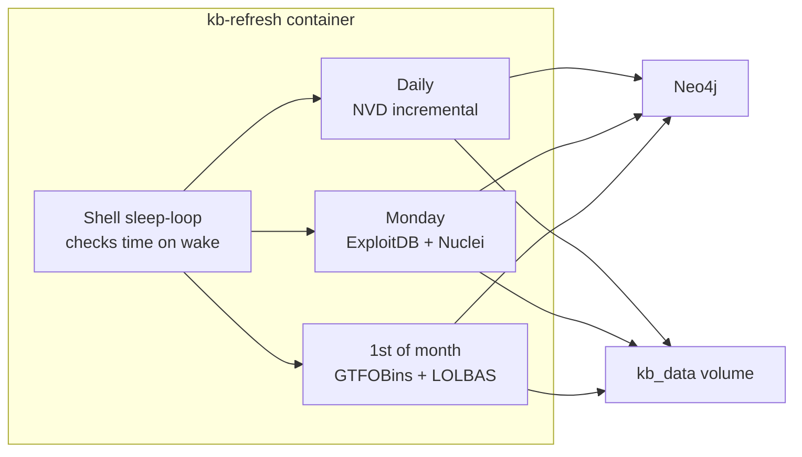

**Enable:**

```bash
KB_REFRESH_ENABLED=true docker compose --profile kb-refresh up -d kb-refresh
```

**Recommended**: Set `NVD_API_KEY` for faster NVD updates (50 req/30s vs 5 req/30s without key). Get a free key at https://nvd.nist.gov/developers/request-an-api-key.

---

## Security Model

The ingestion pipeline handles untrusted external data. Multiple defense layers are implemented:

### Network Safety

- **Hostname allowlist**: All HTTP requests go through `safe_get()`, which validates every URL (including redirect targets) against a hardcoded list of 6 trusted hosts
- **GET-only**: No POST/PUT/DELETE methods exist in the pipeline. Data is never sent outbound
- **Size caps**: Response bodies are capped (200 MB general, 50 MB NVD pages) with streaming enforcement
- **Redirect validation**: Manual redirect handling with per-hop allowlist checks, max 5 hops

### Data Safety

- **Tar decompression**: `bounded_tar_iter()` caps per-member (10 MB) and total (500 MB) decompressed size. Only regular files are extracted -- symlinks, hardlinks, and devices are skipped
- **YAML parsing**: `bounded_yaml_load()` pre-scans for billion-laughs attacks (max 100 anchors, 1000 aliases), deep nesting, and oversized documents before calling `yaml.safe_load()`
- **Path traversal**: `safe_relative_path()` rejects absolute paths, `..` segments, NUL bytes, and paths that escape the base directory after symlink resolution
- **Symlink-safe writes**: `safe_write_text()` uses `O_NOFOLLOW` to prevent TOCTOU symlink attacks

### Index Integrity

- **FAISS manifest**: SHA-256 (or HMAC-SHA256 if `KB_INDEX_HMAC_KEY` is set) digest of the index file, verified before every load
- **Constant-time comparison**: `hmac.compare_digest()` used for all digest checks
- **Atomic writes**: All file writes use tempfile + fsync + rename pattern

### Query Safety

- **Cypher injection**: All Neo4j query values are parameterized. Interpolated identifiers (labels, property keys) pass through a strict `^[A-Za-z_][A-Za-z0-9_]*$` regex
- **Prompt injection**: Three-layer defense (content sanitization, length capping, untrusted content framing)
- **Secret protection**: API keys are redacted in logs, HMAC keys are never logged

---

## Per-Project Runtime Tuning

Project-level settings (stored in the database) can override KB behavior at runtime without restarting the agent. These are applied on every agent invocation via `_apply_project_settings()`.

| Setting | Type | Effect |
|---|---|---|
| `KB_ENABLED` | bool | Disable KB for this project (Tavily-only) |
| `KB_SCORE_THRESHOLD` | float | Override sufficiency threshold |
| `KB_TOP_K` | int | Override default result count |
| `KB_MMR_ENABLED` | bool | Toggle diversity filtering |
| `KB_MMR_LAMBDA` | float | Tune relevance vs diversity balance |
| `KB_OVERFETCH_FACTOR` | int | Control candidate pool size |
| `KB_SOURCE_BOOSTS` | dict | Merge custom per-source boosts |
| `KB_ENABLED_SOURCES` | list | Project-wide source allowlist |

All settings default to `None` (inherit from `kb_config.yaml`). Only non-None values override.

---

## Neo4j Graph Schema

KB data is stored alongside the existing recon graph in Neo4j. All KB nodes use the base label `KBChunk` plus a source-specific label for efficient querying.

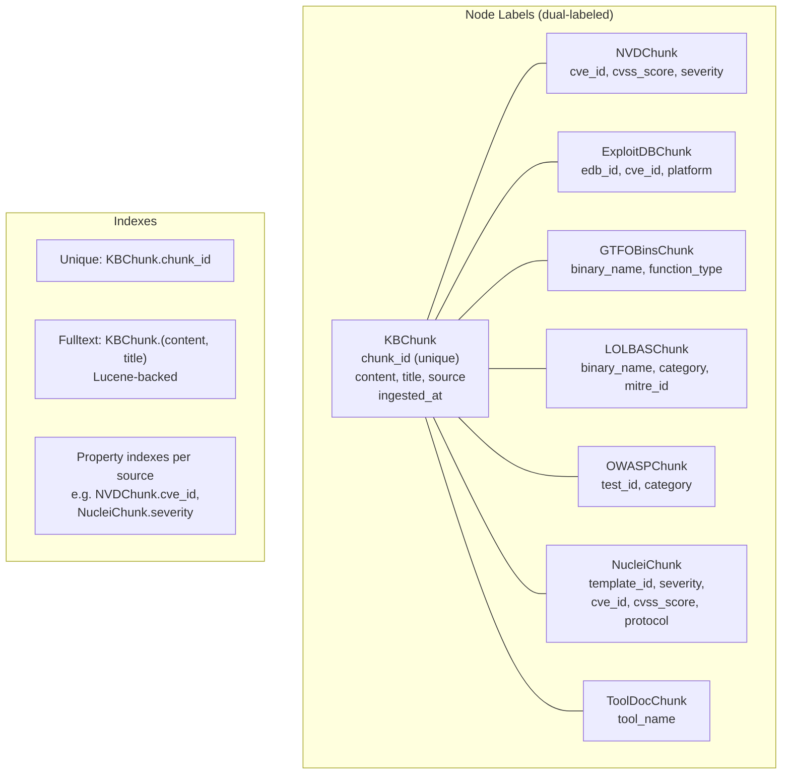

---

## On-Disk Layout

```
knowledge_base/
  __init__.py                      # re-exports PentestKnowledgeBase
  kb_config.py                     # configuration system
  kb_config.yaml                   # default config (mounted :ro)
  kb_orchestrator.py               # query pipeline (PentestKnowledgeBase)
  embedder.py                      # sentence-transformer wrapper
  faiss_indexer.py                 # FAISS index management + integrity
  neo4j_loader.py                  # Neo4j graph operations
  reranker.py                      # cross-encoder reranking
  chunking.py                      # text chunking strategies
  document_store.py                # source file access
  atomic_io.py                     # safe file I/O primitives
  curation/
    __init__.py
    data_ingestion.py              # ingestion orchestrator + CLI
    base_client.py                 # abstract client interface
    safe_http.py                   # hostname-allowlisted HTTP
    file_cache.py                  # caching, hashing, tar/YAML safety
    exploitdb_client.py            # ExploitDB CSV parser
    gtfobins_client.py             # GTFOBins tarball parser
    lolbas_client.py               # LOLBAS tarball parser
    nuclei_client.py               # Nuclei templates parser
    nvd_client.py                  # NVD REST API client
    owasp_client.py                # OWASP WSTG parser
    tool_docs_client.py            # local skill docs reader
  data/                            # runtime data (gitignored)
    index.faiss                    # FAISS vector index
    chunk_ids.json                 # chunk_id -> FAISS int ID mapping
    index.faiss.manifest.json      # integrity digest
    .last_ingest                   # timestamp + profile marker
    cache/
      .manifest.json               # content-hash manifest
      exploitdb/                   # cached CSV
      gtfobins/                    # cached parsed files
      lolbas/                      # cached YAML files
      nuclei/                      # cached templates
      nvd/                         # nvd_cache.json
      owasp/                       # cached markdown files
  tests/
    test_chunking.py
    test_clients.py
    test_data_ingestion.py
    test_embedder.py
    test_faiss_indexer.py
    test_file_cache.py
    test_kb_config.py
    test_kb_orchestrator.py
    test_neo4j_loader.py
    test_reranker.py
    test_safe_http.py
```

---

## Embedding: CPU vs GPU vs API

The KB uses vector embeddings to convert text into searchable vectors. How embeddings are generated depends on your setup.

### Automatic Detection

During `./yousef_shtiwe.sh install` (and `up`/`restart`), yousef_shtiwe automatically detects your capabilities:

| Hardware | What Happens | Ingestion Speed | Profile |
|---|---|---|---|
| **GPU (CUDA)** | sentence-transformers runs on GPU | Fast (~2-5 min) | Full `lite` |
| **API key configured** | External API generates embeddings | Fast (~2-3 min) | Full `lite` |
| **CPU only** | Interactive prompt asks user to choose | Slow for large datasets | `cpu-lite` or `lite` |

On CPU without an API key, you see an interactive prompt with estimated times for each source and the option to do a quick start (cpu-lite, ~15 min) or full ingestion (~4 hours).

**Query time is always fast (~30ms)** regardless of CPU/GPU/API. The speed difference only matters during ingestion.

### API Mode Configuration

Configure in `.env` (copy from `.env.example`):

```bash
KB_EMBEDDING_USE_API=true
KB_EMBEDDING_API_KEY=sk-your-key
KB_EMBEDDING_API_MODEL=text-embedding-3-small
# KB_EMBEDDING_API_BASE_URL=  (leave empty for OpenAI)
```

### OpenAI-Compatible APIs

The embedder uses the OpenAI SDK, which works with **any API that implements the OpenAI embeddings endpoint**. Set `KB_EMBEDDING_API_BASE_URL` to point to the compatible server:

| Provider | Base URL | Notes |
|---|---|---|
| **OpenAI** | *(leave empty)* | Direct OpenAI API |
| **Ollama** | `http://host.docker.internal:11434/v1` | Local models, free |
| **LiteLLM** | `http://host.docker.internal:4000/v1` | Proxy for 100+ providers |
| **Together AI** | `https://api.together.xyz/v1` | Hosted open models |
| **Azure OpenAI** | `https://<resource>.openai.azure.com/...` | Enterprise |
| **vLLM** | `http://host.docker.internal:8000/v1` | Self-hosted GPU server |
| **Fireworks AI** | `https://api.fireworks.ai/inference/v1` | Fast inference |

Example with Ollama (free, runs locally):

```bash
KB_EMBEDDING_USE_API=true
KB_EMBEDDING_API_MODEL=nomic-embed-text
KB_EMBEDDING_API_KEY=ollama
KB_EMBEDDING_API_BASE_URL=http://host.docker.internal:11434/v1
```

### Switching Embedding Models

Ingestion and query **must use the same embedding model**. Different models produce vectors with different dimensions (e.g., e5-large-v2 = 1024d, OpenAI text-embedding-3-small = 1536d). The FAISS index is dimension-locked.

If you switch models, rebuild the index:

```bash
make -C knowledge_base kb-rebuild-lite MODE=docker
```

The ingestion pipeline detects dimension mismatches and will error with a clear message if you forget to rebuild.

### Environment Variables Reference

| Variable | Default | Description |
|---|---|---|
| `KB_EMBEDDING_USE_API` | `false` | Use external API for embeddings |
| `KB_EMBEDDING_API_BASE_URL` | *(OpenAI default)* | API base URL (any OpenAI-compatible endpoint) |
| `KB_EMBEDDING_API_KEY` | *(none)* | API key |
| `KB_EMBEDDING_API_MODEL` | `text-embedding-3-small` | Model name for the API |

---

## Ingestion Entry Points

There are **four ways** ingestion can start. Each ultimately calls the same Python module (`knowledge_base.curation.data_ingestion`), but they are triggered from different contexts.

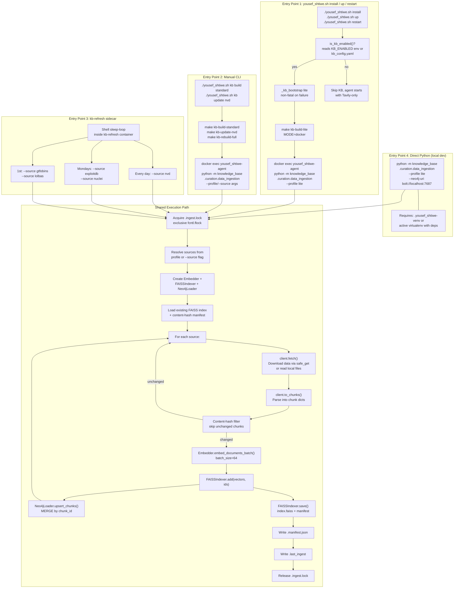

### What happens at each stage

| Step | What runs | Where | Code location |
|---|---|---|---|
| User runs `./yousef_shtiwe.sh install` | Starts containers, then calls `_kb_bootstrap lite` | Host shell | `yousef_shtiwe.sh:364-374` |
| `_kb_bootstrap` calls `make kb-build-lite` | Runs `docker exec` into agent container | Host -> container | `Makefile:132-140` |
| `data_ingestion.main()` starts | Parses CLI args, acquires lock | Agent container | `data_ingestion.py:580-640` |
| `Embedder()` created | Loads `intfloat/e5-large-v2` model (pre-cached in image) | Agent container | `embedder.py:60-70` |
| `FAISSIndexer()` created | Points at `/app/knowledge_base/data`, loads existing index if present | Agent container | `faiss_indexer.py:80-95` |
| `Neo4jLoader()` created | Connects to `bolt://neo4j:7687`, creates schema | Agent container -> Neo4j | `neo4j_loader.py:82-100` |
| `client.fetch()` per source | Downloads tarball/CSV/API data via `safe_get()` | Agent container -> internet | `*_client.py` |
| `client.to_chunks()` | Parses raw data into chunk dicts with `chunk_id`, `content`, `title` | Agent container (CPU) | `*_client.py` |
| `_filter_unchanged()` | SHA-256 content hashes vs `.manifest.json`, drops unchanged | Agent container (CPU) | `data_ingestion.py:430-490` |
| `embedder.embed_documents_batch()` | Runs sentence-transformer model on chunk texts, batch_size=64 | Agent container (CPU) | `embedder.py:130-160` |
| `faiss_indexer.add()` | Adds vectors + chunk_ids to in-memory FAISS index | Agent container (RAM) | `faiss_indexer.py:105-125` |
| `neo4j_loader.upsert_chunks()` | MERGE by chunk_id, dual-label (`:KBChunk:SourceChunk`) | Agent -> Neo4j | `neo4j_loader.py:130-175` |
| `faiss_indexer.save()` | Atomic write `index.faiss` + `chunk_ids.json` + manifest | Agent container (disk) | `faiss_indexer.py:130-175` |

---

## Query Entry Points

Vector queries happen **only** when the LLM agent calls the `web_search` tool during a conversation. There is no other trigger. The flow starts from the user's chat message and passes through several layers before reaching the KB.

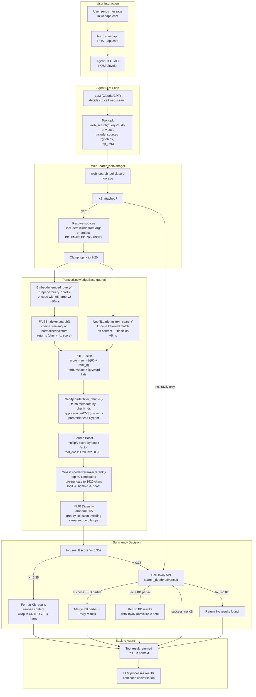

### Step-by-step: what happens when the agent searches

| # | Step | Component | Code location | Latency |
|---|---|---|---|---|
| 1 | User sends chat message | Webapp | `webapp/src/app/api/chat/` | -- |
| 2 | Webapp forwards to agent API | Agent HTTP | `orchestrator.py` | ~ms |
| 3 | LLM decides to call `web_search` | LLM inference | (external API) | ~1-3s |
| 4 | Tool invocation enters `WebSearchToolManager` | Agent | `tools.py:570-580` | -- |
| 5 | Check if KB is attached | Agent | `tools.py:588` | -- |
| 6 | Resolve `include_sources` from args or project settings | Agent | `tools.py:578-582` | -- |
| 7 | Clamp `top_k` to [1, 20] | Agent | `tools.py:587` | -- |
| 8 | `kb.query()` starts | KB Orchestrator | `kb_orchestrator.py:90` | -- |
| 9 | Embed query with `e5-large-v2` (prepend `"query: "`) | Embedder | `embedder.py:100-110` | ~30ms |
| 10 | FAISS inner-product search on normalized vectors | FAISSIndexer | `faiss_indexer.py:110-130` | ~5ms |
| 11 | Neo4j Lucene fulltext search on `content` + `title` | Neo4jLoader | `neo4j_loader.py:285-330` | ~5ms |
| 12 | RRF fusion merges vector + keyword ranked lists | KB Orchestrator | `kb_orchestrator.py:240-270` | <1ms |
| 13 | Neo4j metadata fetch + source/CVSS/severity filter | Neo4jLoader | `neo4j_loader.py:230-280` | ~5ms |
| 14 | Multiply scores by source boost factors | KB Orchestrator | `kb_orchestrator.py:145-155` | <1ms |
| 15 | Cross-encoder rerank (top 30, sigmoid, re-boost) | Reranker | `reranker.py:130-190` | ~200ms |
| 16 | MMR diversity selection (top_k from pool) | KB Orchestrator | `kb_orchestrator.py:280-340` | <1ms |
| 17 | Sufficiency check: `results[0].score >= 0.35` | KB Orchestrator | `kb_orchestrator.py:230-235` | -- |
| 18a | **If sufficient**: sanitize, frame, return KB results | Agent | `tools.py:600-640` | -- |
| 18b | **If insufficient**: call Tavily, merge with partials | Agent | `tools.py:606-626` | ~1-2s |
| 19 | Tool result injected into LLM context | Agent | `orchestrator.py` | -- |

### When does the LLM call web_search?

The LLM autonomously decides when to search based on the tool description in the system prompt. The tool registry (`agentic/prompts/tool_registry.py`) describes `web_search` as available for:

- Looking up CVE details, exploit techniques, tool usage
- Checking vulnerability databases
- Finding attack methodologies or defense strategies
- Researching specific security tools or protocols

The LLM can specify `include_sources` to target specific KB sources (e.g., `["gtfobins"]` for Linux priv-esc, `["nuclei"]` for template-based scanning) or leave it empty to search all sources.

---

## Troubleshooting

### KB not loading on agent startup

```bash
# Check if KB is enabled
docker exec yousef_shtiwe-agent env | grep KB_ENABLED

# Check if index files exist
ls -la knowledge_base/data/index.faiss knowledge_base/data/chunk_ids.json

# Check agent logs for KB init
docker logs yousef_shtiwe-agent 2>&1 | grep -i "knowledge\|kb\|faiss"
```

### Rebuild the index from scratch

```bash
make kb-rebuild-lite   # or standard/full
docker compose build agent && docker compose up -d agent
```

### NVD rate limiting

If NVD ingestion is slow, register for a free API key:

```bash
export NVD_API_KEY=your-key-here
make kb-update-nvd
```

### Check index statistics

```bash
make kb-stats
# or
docker exec yousef_shtiwe-agent python -c "
from knowledge_base.faiss_indexer import FAISSIndexer
idx = FAISSIndexer('/app/knowledge_base/data')
idx.load()
print(f'Vectors: {idx.count()}')
"
```

### Test KB query manually

```bash
docker exec -it yousef_shtiwe-agent python -c "
import asyncio
from tools import WebSearchToolManager
from knowledge_base import PentestKnowledgeBase
from knowledge_base.faiss_indexer import FAISSIndexer
from knowledge_base.neo4j_loader import Neo4jLoader
from knowledge_base.embedder import Embedder
from neo4j import GraphDatabase

embedder = Embedder('intfloat/e5-large-v2')
faiss = FAISSIndexer('/app/knowledge_base/data', dimensions=1024)
driver = GraphDatabase.driver('bolt://neo4j:7687', auth=('neo4j', 'changeme123'))
kb = PentestKnowledgeBase(faiss, Neo4jLoader(driver), embedder)
kb.load()

results = kb.query('sudo privilege escalation linux', top_k=5)
for r in results:
    print(f'{r[\"score\"]:.3f} [{r[\"source\"]}] {r[\"title\"]}')
"
```

### Run unit tests

```bash
make kb-test
# or
pytest knowledge_base/tests -v
```
